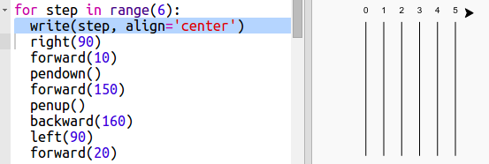

## रेस ट्रैक

आप रेसिंग टर्टल्स की गेम बनाने जा रहे हैं। सबसे पहले उन्हें रेस ट्रैक की आवश्यकता होगी।

+ खाली Python टेंम्पलेट ट्रिंकेट खोलें: <a href="http://jumpto.cc/python-new" target="_blank">jumpto.cc/python-new</a>. 

+ 'टर्टल' का उपयोग करके लाइन बनाने के लिए निम्नलिखित कोड जोड़ें:

  
   
+ चलिए अब रेस के लिए ट्रैक की मार्किंग के लिए टर्टल का उपयोग करें। 

  टर्टल `write` फंक्शन स्क्रीन पर टेक्स्ट लिखता है। 
  
  इसका इस्तेमाल करें:

  
  
+ अब मार्किंग के लिए आपको, इस बीच संख्याओं को जोड़ना चाहिए:

  
  
+ क्या आपने ध्यान दिया कि आपका कोड बहुत दोहराया जा रहा है? इसमें केवल यह अंतर है कि लिखने की संख्या बदल जाती है।

  Python में ऐसा करने के लिए बढ़िया तरीका है। आप `for` लूप का उपयोग कर सकते हैं। 
  
  `for` लूप का उपयोग करने के लिए, अपने कोड को अपडेट करें:
  
  
   
+ हम्म, यह केवल 4 तक संख्या को प्रिंट करता है। Python में `range(5)` 0 से 4 तक पाँच संख्याएँ देता है। इससे 5 प्राप्त संख्याएँ करने के लिए आपको `range(6)` उपयोग करना चाहिए:

  
   
+ अब हम कुछ ट्रैक मार्किंग बना सकते हैं। टर्टल स्क्रीन के मध्य में (0,0) अक्ष से आरंभ करता है। 

  टर्टल को शीर्ष बाईं ओर ले जाएँ:
  
  

+ आह, आप पहले पेन उठाना चाहेंगे!

  
  
+ ट्रैक बनाने के लिए क्षैतिज दिशा में लाइन बनाने के बजाय, वर्टिकल लाइनें बनाएँ:

  
  
  `right(90)` टर्टल को 90 डिग्री (समकोण) पर मोड़ता है। पेन को नीचे रखने से पहले `forward(10)` संख्या और लाइन के आरंभ में बहुत छोटी जगह छोड़ता है। लाइन बनाने के बाद आप पेन उठाते हैं और लाइन की लंबाई और दूरी के योग के समान `backward(160)` जाते हैं। 
  
+ यदि आप संख्याओं को बीच में ले आएँ, तो यह अच्छा दिखाई देगा:

  

+ और आप टर्टल की गति को बढ़ा सकते हैं, ताकि यह तीव्रता से इसे बना ले:

  

