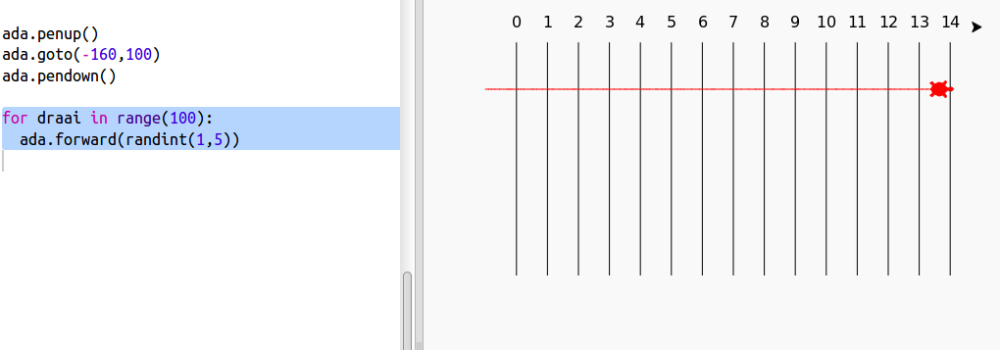

## Raceschildpadden

Nu voor het leuke. Laten we wat raceschildpadden toevoegen. Het zou heel saai zijn als de schildpadden elke keer hetzelfde deden, dus ze zullen elke beurt een willekeurig aantal stappen verplaatsen. De winnaar is de schildpad die het verst komt in 100 beurten.

+ Wanneer je commando's zoals `forward(20)` gebruikt, gebruik je een enkele schildpad. Maar je kunt meer schildpadden maken. Voeg de volgende code toe aan het einde van je script (maar zorg ervoor dat de code niet ingespringt):
    
    
    
    De eerste regel creëert een schildpad genaamd 'ada'. De volgende regels bepalen de kleur en vorm van de schildpad. Nu lijkt het echt op een schildpad!

+ Laten we de schildpad naar de startlijn sturen:
    
    

+ Nu moet je de schildpad laten racen door een willekeurig aantal stappen tegelijk te verplaatsen. Je hebt de ` randint ` functie van de Python ` random ` bibliotheek nodig. Voeg deze `import` regel aan de bovenkant van je script toe:
    
    

+ De `randint` functie retourneert een tussen de gekozen waarden, willekeurig integer (geheel) getal. De schildpad beweegt bij elke beurt 1, 2, 3, 4 of 5 stappen vooruit.
    
    

+ Met een schildpad is het niet echt een race! Laten we er nog een toevoegen:
    
    
    
    Merk op dat de code voor het verplaatsen van de blauwe schildpad in **dezelfde** `for` lus moet zijn als de code voor het verplaatsen van de rode schildpad zodat ze elke beurt een zet doen.